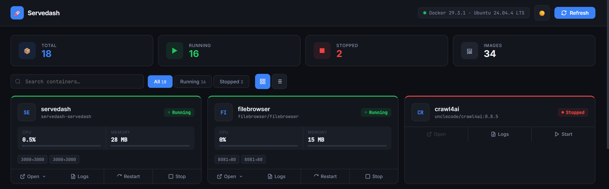
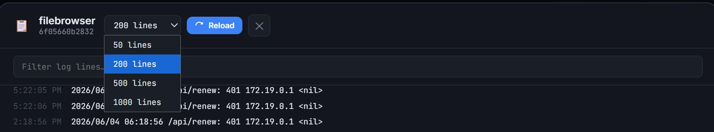
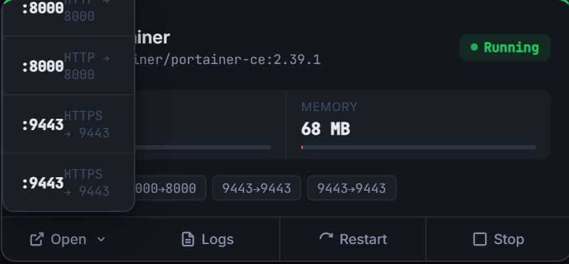

# Servedash 🚀

A simple Docker dashboard I built because Portainer felt too heavy for just wanting to see what's running.

Auto-discovers all your containers, shows CPU/RAM, lets you tail logs, and opens each service — without leaving the page.



## Features

- Scans all Docker containers automatically (running and stopped)
- CPU & RAM usage per container
- Live log viewer with search and filter

- Start / Stop / Restart from the dashboard
- Click to open any service — picks the right port if there are multiple

- Grid and list view
- Dark / light mode

## Getting Started

```bash
git clone https://github.com/DestinyJazz/servedash.git
cd servedash
docker compose up -d
```

Then open `http://your-server-ip:3000`

That's it. No config file needed.

## Portainer

1. Stacks → Add stack
2. Paste `docker-compose.yml`
3. Deploy

## Custom URL for a container

If auto-detection picks the wrong port, add a label:

```yaml
labels:
  - "dashboard.url=https://myapp.example.com"
```

## Change the port

```bash
PORT=8080 docker compose up -d
```

## Local development

```bash
docker compose -f docker-compose.dev.yml up -d --build
```

## Security

Servedash mounts the Docker socket read-only. Don't expose it to the public internet — keep it on your local network or put it behind a reverse proxy with auth.

---

# Servedash 🚀

自己搭的 Docker dashboard，因为觉得 Portainer 对于「只是想看看哪些服务在跑」来说太重了。

自动扫描所有 container，显示 CPU/RAM，可以查 logs，一键打开各个服务 — 不需要切换页面。


## 功能

- 自动扫描所有 Docker container（包括已停止的）
- 每个 container 的 CPU 和内存使用率
- 实时 log 查看器，支持搜索和过滤

- 直接从 dashboard 启动 / 停止 / 重启
- 点击直接打开服务，有多个 port 时会显示选择菜单

- 支持 Grid 和 List 两种视图
- 深色 / 浅色主题切换

## 开始使用

```bash
git clone https://github.com/DestinyJazz/servedash.git
cd servedash
docker compose up -d
```

打开 `http://你的服务器IP:3000`

不需要任何配置文件。

## Portainer 部署

1. Stacks → Add stack
2. 粘贴 `docker-compose.yml` 内容
3. Deploy

## 自定义服务 URL

如果自动检测的 port 不对，加一个 label：

```yaml
labels:
  - "dashboard.url=https://myapp.example.com"
```

## 修改端口

```bash
PORT=8080 docker compose up -d
```

## 本地开发

```bash
docker compose -f docker-compose.dev.yml up -d --build
```

## 安全说明

Servedash 以只读方式挂载 Docker socket。不要暴露在公网上，建议放在内网或者用带认证的反向代理保护。

## License

MIT
