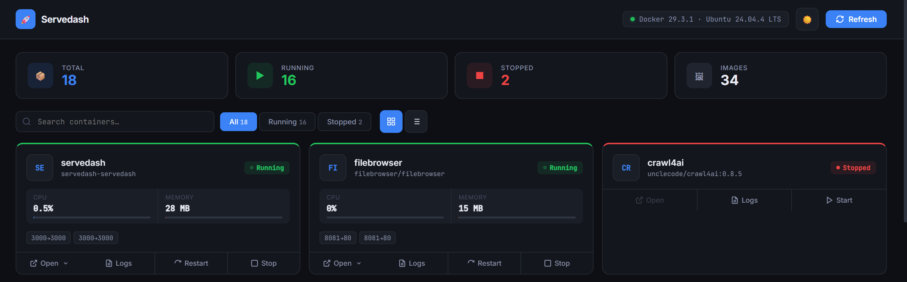
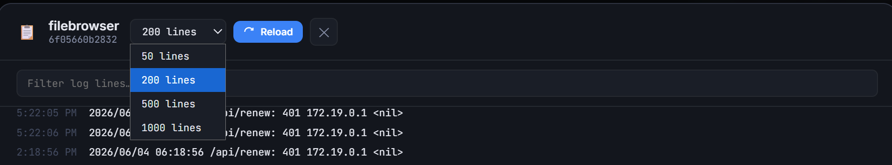
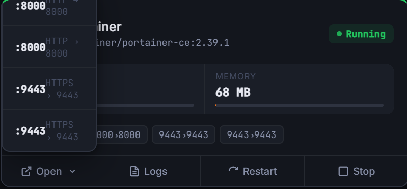
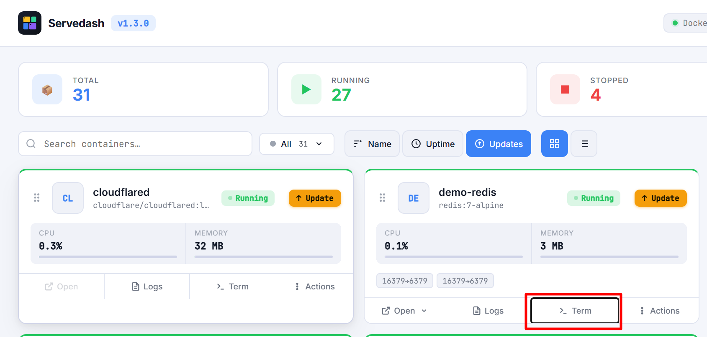
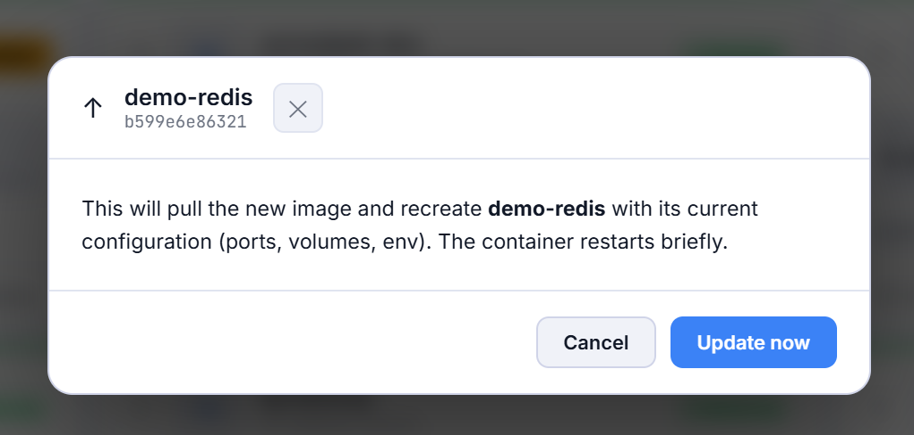
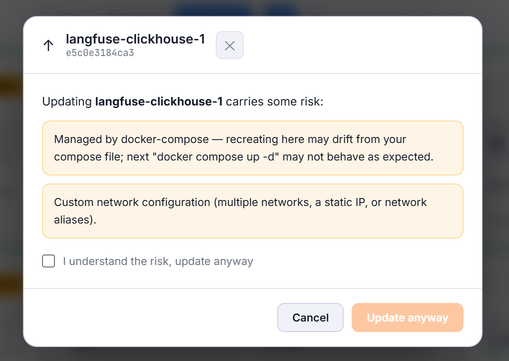

# Servedash 🚀

[](https://github.com/DestinyJazz/servedash/releases)
[](https://github.com/DestinyJazz/servedash/pkgs/container/servedash)
[](https://github.com/DestinyJazz/servedash/blob/main/LICENSE)

<a href="https://www.buymeacoffee.com/djlch" target="_blank"></a>

A simple Docker dashboard I built because Portainer felt too heavy for just wanting to see what's running. A lightweight alternative when you want visibility, not a full management suite.

Auto-discovers all your containers, shows CPU/RAM, lets you tail logs, and opens each service — without leaving the page.



## Features

- Scans all Docker containers automatically (running and stopped)
- CPU & RAM usage per container, with color-coded bars (green / yellow / red by load)
- Live log viewer with search and filter

- Start / Stop / Restart / Pause / Unpause from a per-container Actions menu
- Click to open any service — picks the right port if there are multiple

- Status filter (Running, Stopped, Paused, Unhealthy) with live counts
- Detects unhealthy containers (running but failing their healthcheck)
- Drag cards to reorder, or sort by name, uptime, or available updates
- Image update detection — flags containers when a newer image is available (Docker Hub, GHCR, lscr.io), with a one-click pull + recreate (see [Image updates](#image-updates))

- Built-in web terminal — open an interactive shell inside any running container, no SSH required

- Grid and list view
- Dark / light mode

## Getting Started

```bash
git clone https://github.com/DestinyJazz/servedash.git
cd servedash
docker compose up -d
```

Then open `http://your-server-ip:3000`

That's it. No config file needed.

## Portainer

1. Stacks → Add stack
2. Paste `docker-compose.yml`
3. Deploy

## Custom URL for a container

If auto-detection picks the wrong port, add a label:

```yaml
labels:
  - "servedash.url=https://myapp.example.com"
```

Servedash also reads `homepage.href` if you already use it, so existing Homepage labels work without changes. The older `dashboard.url` label is still supported too.

## Image updates

Servedash can check whether a newer image is available for your containers. When one is, the card shows an "Update" badge.

- Click the cloud icon in the header to check on demand
- Or set `UPDATE_CHECK_INTERVAL` to check automatically
- Only public images on Docker Hub, GHCR, and lscr.io are checked. Private and other registries show as unsupported.

Clicking the "Update" badge pulls the new image and recreates the container with its current configuration (ports, volumes, env, networks). Before touching anything, Servedash classifies the update:

- **Safe** (not managed by docker-compose or a Portainer stack, no custom network setup, no legacy container linking). One click, no extra confirmation.

- **Risky** (compose-managed, Portainer-managed, or has custom networking) — Servedash explains why and requires you to check "I understand the risk, update anyway" before proceeding. Recreating a compose- or Portainer-managed container here can drift from your compose file / stack; the next `docker compose up -d` or Portainer redeploy may not behave as expected.


If anything fails partway through a recreate, Servedash restores the original container rather than leaving you with neither.

## Configuration

All optional, set via environment variables in `docker-compose.yml`:

| Variable | Default | Description |
|---|---|---|
| `PORT` | `3000` | Port Servedash listens on |
| `REFRESH_INTERVAL` | `0` | Auto-refresh container status, in seconds. 0 = off |
| `UPDATE_CHECK_INTERVAL` | `0` | Auto-check for image updates, in minutes. 0 = manual only |

To keep your drag order across restarts, mount a volume at `/app-data`:

```yaml
volumes:
  - servedash-data:/app-data
```

## Change the port

```bash
PORT=8080 docker compose up -d
```

## Local development

```bash
docker compose -f docker-compose.dev.yml up -d --build
```

## Security

Servedash mounts the Docker socket read-write — it needs this for the built-in terminal (`docker exec`) and one-click image updates (pull/stop/create/remove). This is equivalent to root on the host. Don't expose it to the public internet — keep it on your local network or put it behind a reverse proxy with auth.

---

# Servedash 🚀

[](https://github.com/DestinyJazz/servedash/releases)
[](https://github.com/DestinyJazz/servedash/pkgs/container/servedash)
[](https://github.com/DestinyJazz/servedash/blob/main/LICENSE)

<a href="https://www.buymeacoffee.com/djlch" target="_blank"></a>

自己搭的 Docker dashboard，因为觉得 Portainer 对于「只是想看看哪些服务在跑」来说太重了。一个轻量替代方案，适合只想看状态、不需要完整管理套件的场景。

自动扫描所有 container，显示 CPU/RAM，可以查 logs，一键打开各个服务 — 不需要切换页面。


## 功能

- 自动扫描所有 Docker container（包括已停止的）
- 每个 container 的 CPU 和内存使用率，使用条按负载变色（绿 / 黄 / 红）
- 实时 log 查看器，支持搜索和过滤

- 通过每个容器的 Actions 菜单进行 启动 / 停止 / 重启 / 暂停 / 恢复
- 点击直接打开服务，有多个 port 时会显示选择菜单

- 状态筛选（Running、Stopped、Paused、Unhealthy），带实时计数
- 检测不健康容器（在运行但健康检查失败）
- 拖拽卡片排序，或按名称、运行时间、有无更新排序
- 镜像更新检测：有新版镜像时在卡片上标记（Docker Hub、GHCR、lscr.io），支持一键 pull + 重建（见「镜像更新」）

- 内置网页终端：直接在浏览器里打开任意运行中容器的交互式 shell，不需要 SSH

- 支持 Grid 和 List 两种视图
- 深色 / 浅色主题切换

## 开始使用

```bash
git clone https://github.com/DestinyJazz/servedash.git
cd servedash
docker compose up -d
```

打开 `http://你的服务器IP:3000`

不需要任何配置文件。

## Portainer 部署

1. Stacks → Add stack
2. 粘贴 `docker-compose.yml` 内容
3. Deploy

## 自定义服务 URL

如果自动检测的 port 不对，加一个 label：

```yaml
labels:
  - "servedash.url=https://myapp.example.com"
```

如果你已经在用 `homepage.href`，Servedash 也会读取，现有的 Homepage label 不用改动就能用。旧的 `dashboard.url` label 同样仍然支持。

## 镜像更新

Servedash 可以检查容器是否有新版镜像。有的话，卡片上会显示「Update」标记。

- 点击 header 的云图标手动检查
- 或设置 `UPDATE_CHECK_INTERVAL` 自动检查
- 只检查 Docker Hub、GHCR、lscr.io 上的公开镜像。私有和其他 registry 显示为不支持。

点击「Update」标记会 pull 新镜像，并用当前容器的配置（端口、volume、环境变量、网络）重建容器。在改动任何东西之前，Servedash 会先做风险分类：

- **安全**（不是 docker-compose 或 Portainer stack 管理的、没有自定义网络配置、没有用旧式容器 link）。一键完成，不需要额外确认。

- **有风险**（compose 管理、Portainer 管理，或有自定义网络配置）— Servedash 会说明具体原因，需要你勾选「我理解风险，仍然更新」才会继续。在这里重建一个 compose/Portainer 管理的容器，可能会让它跟你的 compose 文件或 stack 状态不一致，下次 `docker compose up -d` 或 Portainer redeploy 时行为可能对不上。


如果重建过程中途失败，Servedash 会恢复原容器，不会让你两边都没有。

## 配置项

均为可选，通过 `docker-compose.yml` 里的环境变量设置：

| 变量 | 默认值 | 说明 |
|---|---|---|
| `PORT` | `3000` | Servedash 监听的端口 |
| `REFRESH_INTERVAL` | `0` | 容器状态自动刷新，单位秒。0 = 关闭 |
| `UPDATE_CHECK_INTERVAL` | `0` | 自动检查镜像更新，单位分钟。0 = 只手动 |

要让拖拽顺序在重启后保留，挂载一个卷到 `/app-data`：

```yaml
volumes:
  - servedash-data:/app-data
```

## 修改端口

```bash
PORT=8080 docker compose up -d
```

## 本地开发

```bash
docker compose -f docker-compose.dev.yml up -d --build
```

## 安全说明

Servedash 以读写方式挂载 Docker socket —— 内置终端（`docker exec`）和一键镜像更新（pull/stop/create/remove）都需要这个权限，等同于宿主机的 root 权限。不要暴露在公网上，建议放在内网或者用带认证的反向代理保护。

## License

MIT
